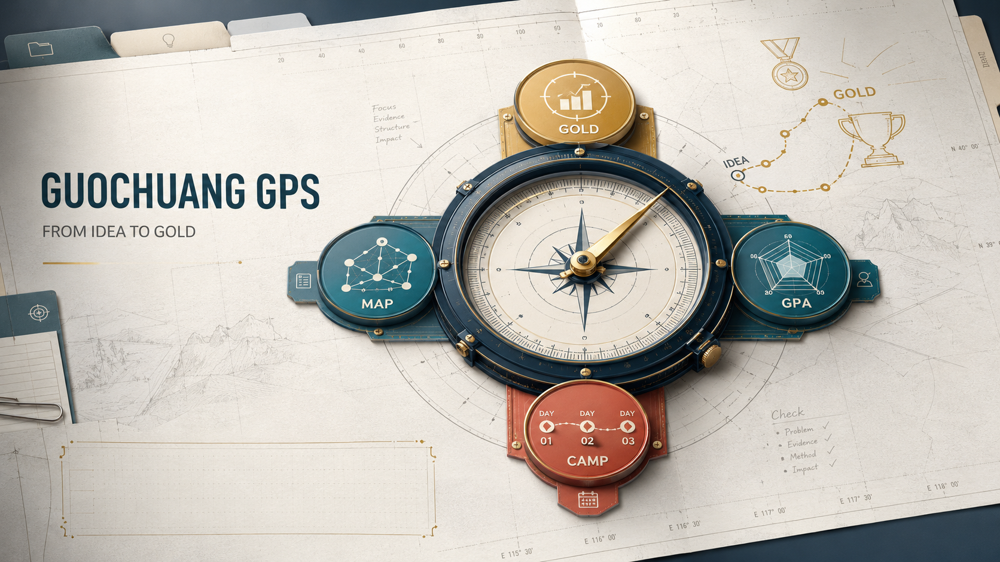

<p align="center">
  
</p>

<p align="center">🧭 <strong>Turn competition materials into one project story that can stand up to questions.</strong></p>

<p align="center">
  <a href="README.md">简体中文</a> ·
  <strong>English</strong>
</p>

<p align="center">
  
</p>

GPS stands for **G**uochuang **P**reparation **S**kills. The name reflects its role as a project navigator. It helps a team locate the project's current position and turn the next preparation step into a clear action.

Guochuang GPS is built for teams entering the China International College Students' Innovation Competition. Its Skills are reusable workflows that run through an Agent host such as Codex or Claude Code. They help teams review **positioning, candidate advantages, innovation value, market opportunity, and evidence gaps**.

## What you can do with GPS

A full review covers the **positioning statement, core advantages, and three leading selling points**, followed by innovation and market findings, rubric gaps, an **evidence ledger, and three priority actions**. Important conclusions include their material source and current evidence status, so the team can use the report while revising its proposal, slides, and defense script.

GPS returns a Markdown report in the current conversation by default. When a saved file is requested without a filename, a full diagnosis uses `<project-name>-GPS评审.md`; focused reports use names such as `<project-name>-创新评审.md` or `<project-name>-PPT评审.md`. Existing files receive `-02`, `-03`, and later suffixes instead of being overwritten. Teams can also request a focused market review, innovation check, deck review, or defense rehearsal.

## Get started in three minutes

Codex users need a Codex CLI that provides the `codex plugin` commands. Run the following commands in a terminal.

```text
codex plugin marketplace add leewayworks/guochuang-gps
codex plugin add guochuang-gps@guochuang-gps
```

After installation, run `codex plugin list` to confirm that the plugin appears. Start a new conversation and provide the project folder with its basic competition details.

```text
Use GPS to review G:\path\to\project
Year: 2026
Track and group: Higher education main track, creative group
Stage: provincial preparation
```

A focused request works as well.

```text
Use GPS to identify this project's core advantages and top three selling points, then map the evidence gaps to the higher education creative-group rubric.
```

Teams can begin while the track is undecided or the material folder is still being assembled. GPS reads the available material first, then follows up on details that affect eligibility, rubric selection, or the next action.

Claude Code users can copy the individual directories under `skills/` into their personal Skills directory.

PowerShell

```powershell
New-Item -ItemType Directory -Force "$env:USERPROFILE\.claude\skills"
Copy-Item -Recurse -Force .\skills\* "$env:USERPROFILE\.claude\skills\"
claude plugin list
```

macOS or Linux

```bash
mkdir -p ~/.claude/skills
cp -R skills/* ~/.claude/skills/
claude plugin list
```

Start a new Claude Code session after copying the directories. For another Agent host, copy them into the Skills location specified by that host.

## How GPS selects selling points

Patents, awards, market estimates, partner names, and claims of being first can all provide leads. GPS checks their **comparison set, scope, and source** in the context of the selected track before placing them among the main selling points.

A selling point supported by evidence answers five questions.

1. Who has the problem, and what consequence does it create?
2. What did the team do differently?
3. What result was achieved, and under which test or use conditions?
4. Which files, data, or records support the result?
5. Where does the conclusion apply, and what limits remain?

GPS's method library was built by closely reviewing **67 projects that won national gold awards** across the **Higher Education Main Track, the Red Dream Track, and the Industry Track**. We worked through their proposals, online-review drafts, pitch decks, final-round materials, and training slides.

The library also carries the practical experience of **17 national-gold contestants** and the review approach of **five expert judges**. Contestants know how project materials take shape through repeated choices. Judges know **what catches attention and which questions are likely to surface on stage**. GPS brings those perspectives together in its approach to project diagnosis.

During review, GPS tracks **what each project cut, kept, or moved** as its materials evolved. Those changes reveal how a team found its main story and shaped the evidence around it. We then read the changes alongside competition rubrics and training materials to identify the questions judges return to most often. The findings became **9 [anonymous method cards](skills/positioning/references/case-patterns.md)** that help each team find its project story, strongest advantages, and next round of improvements. The shared figures and counting rules are recorded in the [method-source summary](skills/positioning/references/method-sources.md).

## Rubrics matched to the track

The repository includes **seven scoring cards** drawn from the official 2025 competition rules.

| Track | Groups |
| --- | --- |
| Higher education main track | Creative (创意组), startup (创业组) |
| Youth Red Dream Building Journey | Charity (公益组), creative (创意组), startup (创业组) |
| Industry track | Enterprise proposition (企业命题组), results transfer (成果转化组) |

The cards use the [official publication page](https://cy.ncss.cn/en/notifications/2c93f4c696aa01a10196eca57202006a) as their primary source and a [complete 19-page mirror](https://www.cupk.edu.cn/cxcy/upload/resources/file/2025/06/23/102490.pdf) to check the tables. Version and provenance details are available in the [source registry](skills/gps-common/references/source-registry.yaml).

While the 2026 review rules remain pending, GPS selects the 2025 card for the same track and group and carries the year status into the result.

```yaml
rubric_version: 2025-05-20
rubric_status: historical_baseline
current_year_rubric_status: pending
```

The diagnosis presents project preparation through three views.

| Output | What it shows |
| --- | --- |
| `rubric_alignment_score` | How well the current evidence covers the rubric's top-level dimensions |
| `gps_readiness` | Whether the project is organizing foundations, building evidence, preparing for review, or preparing for defense |
| `evidence_coverage` | Coverage of the problem, mechanism, result, external validation, and continued use |

For `rubric_alignment_score`, each top-level dimension receives an evidence-readiness anchor from 0 to 4. GPS applies the official top-level weight to produce a 0-to-100 alignment score. The score describes preparation of the material and evidence. Formal results come from the competition review, while school and provincial formats, schedules, and procedures follow local notices.

## Skill map

GPS has **eight task Skills** and one directory of shared rules.

| Skill | Responsibility |
| --- | --- |
| `navigator` | Materials review, rubric and version selection, routing, and synthesis |
| `positioning` | Project essence, candidate advantages, leading selling points, and opportunity framing |
| `evidence` | Claim ledger, file checks, contradictions, and privacy review |
| `innovation` | Mechanism, baseline, fair comparison, experiments, and reproducibility |
| `business` | Customer stage, market method, pricing, unit economics, and delivery risk |
| `proposal` | Competition proposal structure, section claims, and revision queue |
| `deck` | Pitch flow, slide claims, visual evidence, and cuts for the time limit |
| `defense` | Judge questions, answer cards, and pressure testing |
| `gps-common` | Shared routing, source, and output rules |

`navigator` brings the full review together. `evidence` checks the material behind factual conclusions, while focused requests go directly to the relevant Skill.

## Run the local example

The repository includes a synthetic project for checking rubric routing and evidence handling.

```powershell
python scripts/gps_score.py examples/demo-project.json
```

Its evidence paths are intentionally absent, showing how the scorer handles missing material, evidence coverage, and an unsupported quantitative claim.

## Material handling and privacy

Project materials do not need to be committed to this public repository. GPS reads and processes them through the Agent host selected by the team. Data transfer and retention follow that host's settings and data policy.

Student identity records, customer-confidential documents, personal contact details, unreleased IP, and original competition files belong in the team's own workspace. The public repository contains anonymous methods, rule indexes, and synthetic examples.

## Contributors and acknowledgment

- [leewayworks](https://github.com/leewayworks) provides project direction, domain material, methodological judgment, and maintenance.
- OpenAI Codex assisted with source comparison, implementation, testing, and Chinese and English documentation editing.

Guochuang GPS is independently maintained. It is not an official OpenAI product.

## License

[MIT](LICENSE)
