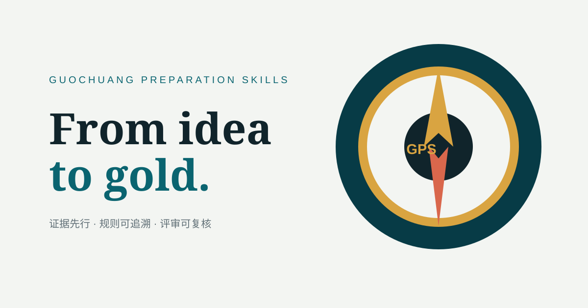

# Guochuang GPS

## From idea to gold. Navigate your Guochuang journey.

Guochuang GPS（Guochuang Preparation Skills）是一套面向中国国际大学生创新大赛的开源备赛能力。它把项目诊断拆成四个容易记住的坐标：

- **GPA** — Guochuang Project Assessment：项目水平评分与证据覆盖；
- **GOLD** — Gold-level Optimization & Level Diagnosis：国金差距诊断；
- **MAP** — Materials Assessment & Preparation：材料完整性地图；
- **CAMP** — Competition Agents for Materials & Pitch：阶段化备赛训练。

> 证据先行 · 规则可追溯 · 评审可复核



## 30 秒体验

```powershell
python scripts/gps_score.py examples/demo-project.json
```

输出包含当前水平区间、分数、证据覆盖率、置信度、阻断缺口和合规发现。示例项目刻意保留一个未核验数字，方便观察 GPS 如何阻止过度承诺。

双击 `site/index.html` 或将 `site/` 发布到 GitHub Pages，可浏览交互式产品介绍：罗盘、GPA 雷达、材料地图和 72 小时 CAMP 路线。

## 安装

### Codex / Claude 插件

```text
codex plugin marketplace add leewayworks/guochuang-gps
codex plugin install guochuang-gps@guochuang-gps
```

也可以将仓库中的 `skills/` 复制到本地 skills 目录，单独加载 `navigator`、`proposal`、`deck`、`defense`、`innovation`、`business` 或 `evidence`。

### 一次诊断怎么开始

把项目材料目录、目标年份、赛道/组别、比赛阶段和截止时间交给 `$navigator`。它先锁定规则，再建立 MAP，随后调用 GPA 与对应专家 skill。没有来源的数字只会进入缺口清单，不会被填成“看起来完整”的正文。

## 2026 规则边界

仓库内 `references/rules-2026.md` 摘录教育部教高函〔2026〕26号及全国大学生创业服务网的当前信息。2026 评审规则、统一页数/时长仍需等待官网或地方细则；当前评分示例明确标注为 2025 官方基线。主通知与产业附件关于教师/师生组队存在表述张力，GPS 会保留冲突并提示向赛区确认。

官方通知之外的高校通知、政策提示和公众号文章只作为解释层；历史国金/国银材料只用于结构与证据模式校准，不能推出本项目奖项，也不进入公开仓库。

## 仓库结构

```text
skills/       可单独加载的七个能力模块
agents/       scout / auditor / judge / architect / coach 角色协议
GPA/ GOLD/ MAP/ CAMP/  四个品牌入口
references/   2026 规则卡、来源等级与材料规律
scripts/      可复核的确定性评分/合规脚本
tests/        RED 压力基线与行为契约
site/         发布会风格的静态展示站
```

## 设计取舍

GPS 借鉴了 Anthropic Agent Skills、OpenAI Skills、obra/superpowers、wshobson/agents 与 ARIS 的几条成熟经验：短路由 + 按需 references、可组合角色、可恢复的结构化产物、独立审阅和本地可执行 demo。GitHub star 仅作为 2026-08-12 UTC 的生态快照，不代表质量证明。

## 诚信与隐私

GPS 可以帮助团队梳理、审校、提问和排期；核心项目书、PPT、实验数据和答辩内容必须由团队成员基于真实材料完成。请不要把学生个人信息、客户保密文件、未公开专利或原始竞赛材料提交到公开仓库。项目不是官方报名系统、评委或获奖保证服务。

## License

MIT
